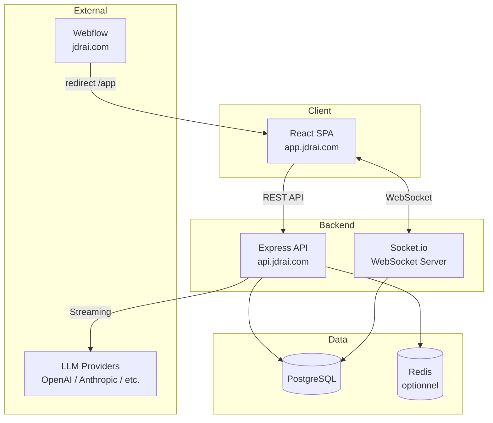

# JDRAI - Architecture Fullstack

**Version:** 1.4
**Date:** 2026-02-08
**Statut:** Validé par CEO
**Auteur:** Architect (BMAD Method)

---

## Change Log

| Date       | Version | Description                                                                                                                                                                                                                                             | Auteur    |
| :--------- | :------ | :------------------------------------------------------------------------------------------------------------------------------------------------------------------------------------------------------------------------------------------------------ | :-------- |
| 2026-02-05 | 1.0     | Version initiale                                                                                                                                                                                                                                        | Architect |
| 2026-02-05 | 1.1     | Auth: Better Auth + abstraction AuthService                                                                                                                                                                                                             | Architect |
| 2026-02-06 | 1.2     | Intégration audit cohérence PRD/UX (13 actions §19 → sections principales)                                                                                                                                                                              | Architect |
| 2026-02-06 | 1.3     | Intégration Milestones P1 (table dédiée, ERD, DTOs, API, backend, frontend)                                                                                                                                                                             | Architect |
| 2026-02-08 | 1.4     | Audit cohérence wireframes — register sans username, Difficulty 4 valeurs, estimatedDuration, tone optionnel P1, character defaults, reset-password route, AdventureStatus simplifié, limite 5 aventures, email verification, onglet Aventure permanent | PM        |

---

## Table des matières

| Document                                               | Contenu                                                     |
| ------------------------------------------------------ | ----------------------------------------------------------- |
| **[README.md](./README.md)** (ce fichier)              | Vue d'ensemble, stack, structure projet                     |
| **[data-models.md](./data-models.md)**                 | Modèles de données (ERD), DTOs TypeScript, package shared   |
| **[api.md](./api.md)**                                 | Endpoints REST, format de réponse, gestion des erreurs      |
| **[frontend.md](./frontend.md)**                       | Architecture frontend, routing, auth client, résilience, UX |
| **[backend.md](./backend.md)**                         | Architecture backend, LLM, auth service, middleware         |
| **[infrastructure.md](./infrastructure.md)**           | Workflow dev, Docker, sécurité, monitoring, variables env   |
| **[coding-standards.md](./coding-standards.md)**       | Standards de code, naming, patterns, Git                    |
| **[testing-conventions.md](./testing-conventions.md)** | Stratégie de tests                                          |
| **[checklist.md](./checklist.md)**                     | Checklist de validation (P1, P2, P3)                        |

---

## Introduction

Ce document définit l'architecture complète de JDRAI, une plateforme de jeu de rôle avec MJ IA. Il sert de source de vérité pour le développement, couvrant le backend, le frontend et leur intégration.

**Projet Greenfield** — Aucun starter template utilisé.

---

## Architecture Haut Niveau

### Résumé Technique

JDRAI adopte une **architecture monorepo fullstack** avec séparation claire entre l'API Express et le frontend React SPA. Le backend gère l'authentification via Better Auth (avec abstraction AuthService pour limiter le lock-in), la persistance PostgreSQL via Drizzle ORM, et l'intégration multi-provider LLM pour le MJ IA. Le frontend utilise TanStack Router pour le routing type-safe et TanStack Query pour la gestion du cache serveur. Les types sont partagés via un package interne, garantissant la cohérence des contrats API sans coupler le frontend à l'ORM.

### Plateforme et Infrastructure

**Plateforme cible:** Self-hosted / VPS (flexibilité maximale)

| Service              | Technologie           | Justification                     |
| -------------------- | --------------------- | --------------------------------- |
| Hébergement API      | Docker / VPS          | Contrôle total, coûts prévisibles |
| Hébergement Frontend | CDN / Static hosting  | Performance, cache edge           |
| Base de données      | PostgreSQL (Docker)   | ACID, JSON support, maturité      |
| Cache                | Redis (optionnel P2+) | Sessions, rate limiting           |

**Déploiement initial:** Docker Compose (dev/staging), migration vers Kubernetes possible en scale-up.

### Diagramme d'Architecture



### Patterns Architecturaux

| Pattern                | Description                    | Justification                                  |
| ---------------------- | ------------------------------ | ---------------------------------------------- |
| **Monorepo**           | Code partagé entre apps        | DX, cohérence des types, refactoring simplifié |
| **SPA + API séparée**  | Frontend découplé du backend   | Déploiement indépendant, scalabilité           |
| **Repository Pattern** | Abstraction accès données      | Testabilité, changement d'ORM possible         |
| **Service Layer**      | Logique métier isolée          | Réutilisabilité, tests unitaires               |
| **DTO Pattern**        | Objets de transfert explicites | Découplage DB/API, sécurité                    |
| **Provider Pattern**   | Abstraction LLM                | Multi-provider, fallback                       |

---

## Stack Technique

| Catégorie              | Technologie       | Version | Rôle                 | Justification                              |
| :--------------------- | :---------------- | :------ | :------------------- | :----------------------------------------- |
| **Monorepo**           | Turborepo         | ^2.x    | Orchestration builds | Cache, parallélisation, DX                 |
| **Package Manager**    | pnpm              | ^9.x    | Gestion dépendances  | Workspaces natifs, performance             |
| **Langage**            | TypeScript        | ^5.x    | Typage               | Sécurité, DX, partage de types             |
| **Frontend Framework** | React             | ^18.x   | UI                   | Écosystème, TanStack compat                |
| **Build Tool**         | Vite              | ^5.x    | Bundling frontend    | HMR rapide, ESM natif                      |
| **Routing**            | TanStack Router   | ^1.x    | Navigation type-safe | Type inference, file-based                 |
| **Data Fetching**      | TanStack Query    | ^5.x    | Cache serveur        | Stale-while-revalidate, mutations          |
| **UI Components**      | shadcn/ui         | latest  | Design system        | Accessible, customizable, Tailwind         |
| **Styling**            | Tailwind CSS      | ^3.x    | Utilitaires CSS      | Productivité, bundle optimisé              |
| **Formulaires**        | React Hook Form   | ^7.x    | Gestion forms        | Performance, validation                    |
| **Validation**         | Zod               | ^3.x    | Schémas runtime      | Inférence TS, partage front/back           |
| **Backend Framework**  | Express           | ^4.x    | API HTTP             | Maturité, middleware ecosystem             |
| **ORM**                | Drizzle           | ^0.30+  | Accès BDD            | Type-safe, SQL-like, léger                 |
| **Schema Gen**         | drizzle-zod       | ^0.5+   | Génération Zod       | Sync schémas DB/validation                 |
| **Base de données**    | PostgreSQL        | 16.x    | Persistance          | ACID, JSONB, performances                  |
| **Auth**               | Better Auth       | ^1.x    | Authentification     | Drizzle natif, TypeScript-first, YC backed |
| **Temps réel**         | Socket.io         | ^4.x    | WebSocket            | Rooms, reconnexion auto                    |
| **Tests Unit**         | Vitest            | ^1.x    | Tests rapides        | Vite compat, ESM natif                     |
| **Tests E2E**          | Playwright        | ^1.x    | Tests navigateur     | Multi-browser, fiable                      |
| **Linting**            | ESLint + Prettier | latest  | Qualité code         | Standards, formatting                      |

---

## Structure Projet Complète

```
jdrai/
├── apps/
│   ├── web/                    # React + Vite SPA
│   │   ├── src/
│   │   ├── public/
│   │   ├── index.html
│   │   ├── vite.config.ts
│   │   ├── tailwind.config.ts
│   │   ├── tsconfig.json
│   │   └── package.json
│   └── api/                    # Express backend
│       ├── src/
│       ├── drizzle.config.ts
│       ├── tsconfig.json
│       └── package.json
├── packages/
│   └── shared/                 # Types & schémas partagés
│       ├── src/
│       ├── tsconfig.json
│       └── package.json
├── docker/
│   ├── Dockerfile.api
│   ├── Dockerfile.web
│   └── docker-compose.yml
├── docs/
│   ├── prd.md
│   ├── architecture/
│   └── ux/
├── .github/
│   └── workflows/
│       ├── ci.yml
│       └── deploy.yml
├── turbo.json
├── pnpm-workspace.yaml
├── package.json
├── .env.example
├── .gitignore
└── README.md
```

```
Structure: Monorepo
Outil: Turborepo + pnpm workspaces
Organisation: apps/ + packages/
```

---

**Document généré via BMAD Method — Phase Architecture**
