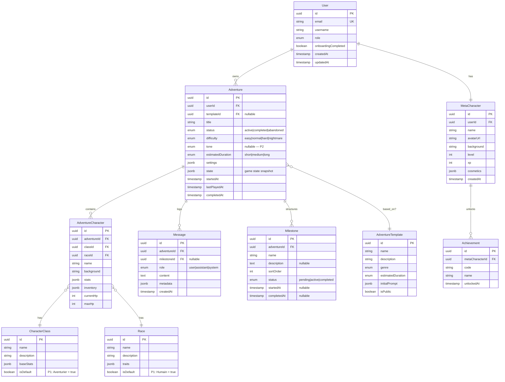

# Modèles de Données

> **Note MVP** : Les modèles ci-dessous représentent la structure initiale. Certains champs (notamment `CharacterStats`, système de règles, races/classes) seront affinés lors de la phase de game design. Le schéma Drizzle permettra des migrations incrémentales.

---

## Vue d'Ensemble (ERD)



---

## Structure narrative : Milestones (P1) — Décision architecture

> **Source** : PRD v1.3 §3.4, UX Cartography §2.6

### Décision : Table dédiée `Milestone`

Les milestones sont implémentés en tant que **table relationnelle dédiée** (et non JSONB dans `Adventure.state`).

**Justification :**

1. **Requêtes structurées** — Le Hub affiche `currentMilestone` par aventure, l'historique groupe les messages par milestone, l'écran de fin récapitule les milestones complétés. Une table dédiée rend ces requêtes simples et performantes
2. **Anticipation P2 (Events)** — Les Events nécessiteront une FK vers `Milestone`. Impossible proprement avec du JSONB
3. **Intégrité référentielle** — Les messages sont liés à un milestone via `milestoneId` FK nullable, garantissant la cohérence
4. **Analytique** — Durée par milestone, taux de complétion, patterns narratifs exploitables via SQL standard

### Règles métier

| Règle                                     | Détail                                                                                                                            |
| ----------------------------------------- | --------------------------------------------------------------------------------------------------------------------------------- |
| **Corrélation durée-milestones**          | `AdventureTemplate.estimatedDuration` guide le nombre de milestones générés par le LLM (courte = 2-3, moyenne = 4-5, longue = 6+) |
| **`currentMilestone` sur `AdventureDTO`** | Champ **dérivé** (résolu depuis le milestone avec `status = "active"`), jamais stocké en DB                                       |
| **Progression numérique interdite**       | Le frontend ne reçoit JAMAIS de données position/total. Seul le nom du milestone actuel est exposé                                |
| **Lien Message → Milestone**              | `Message.milestoneId` FK nullable — les messages sont taggés avec le milestone actif au moment de leur création                   |
| **Anticipation Events (P2)**              | Table `Event` liée par `milestoneId` FK. Aucune implémentation en P1                                                              |

### Valeurs par défaut P1

> **Contexte** : En P1, la création de personnage d'aventure (E14) n'existe pas. Le serveur remplit automatiquement les champs requis.

| Donnée                  | Comportement P1                                                                                                                                                                                                                                    |
| ----------------------- | -------------------------------------------------------------------------------------------------------------------------------------------------------------------------------------------------------------------------------------------------- |
| **Race**                | Table `Race` seedée avec une entrée par défaut `Humain` (`isDefault: true`). Si le joueur a complété le tutoriel, la race choisie en E7 est utilisée. Sinon, `Humain` est attribué automatiquement.                                                |
| **Classe**              | Table `CharacterClass` seedée avec une entrée par défaut `Aventurier` (`isDefault: true`). Si le joueur a complété le tutoriel, la classe choisie en E7 est utilisée. Sinon, `Aventurier` est attribué automatiquement.                            |
| **Personnage aventure** | Si `character` est absent dans `AdventureCreateInput`, le serveur crée un `AdventureCharacter` à partir du méta-personnage (nom, race, classe). Si pas de méta-personnage (skip onboarding), utilise le pseudo comme nom + race/classe par défaut. |
| **Tone**                | `null` en P1. Le LLM utilise un ton par défaut (`epic`). Sélection exposée en P2 (F6).                                                                                                                                                             |
| **Limite aventures**    | Maximum **5 aventures solo actives** simultanément. Vérification côté serveur à la création (`POST /adventures`). Erreur `CONFLICT` si limite atteinte.                                                                                            |

---

## Interfaces TypeScript (DTOs - `packages/shared`)

```typescript
// packages/shared/src/types/user.ts
export interface UserDTO {
  id: string;
  email: string;
  username: string;
  role: "user" | "admin";
  onboardingCompleted: boolean;
  createdAt: string;
}

export interface UserCreateInput {
  email: string;
  username: string;
  password: string;
}

export interface UserLoginInput {
  email: string;
  password: string;
}
```

```typescript
// packages/shared/src/types/adventure.ts
export type AdventureStatus = "active" | "completed" | "abandoned";
export type Difficulty = "easy" | "normal" | "hard" | "nightmare";
export type Tone = "serious" | "humorous" | "epic" | "dark";
export type EstimatedDuration = "short" | "medium" | "long";

export interface AdventureDTO {
  id: string;
  title: string;
  status: AdventureStatus;
  difficulty: Difficulty;
  tone?: Tone; // P2 — nullable, valeur par défaut serveur en P1
  estimatedDuration: EstimatedDuration;
  currentMilestone?: string; // Nom du milestone actuel (affiché Hub + historique)
  startedAt: string;
  lastPlayedAt: string;
  character: AdventureCharacterDTO;
}

export interface AdventureCreateInput {
  templateId?: string;
  title?: string; // Généré par le LLM si absent
  difficulty: Difficulty;
  tone?: Tone; // P2 — optionnel, valeur par défaut serveur en P1
  estimatedDuration: EstimatedDuration;
  character?: AdventureCharacterCreateInput; // Optionnel — si absent, le serveur crée un personnage à partir du méta-personnage (ou défauts P1)
}

export interface AdventureCharacterDTO {
  id: string;
  name: string;
  className: string;
  raceName: string;
  stats: CharacterStats;
  currentHp: number;
  maxHp: number;
}

export interface AdventureCharacterCreateInput {
  name: string;
  classId: string;
  raceId: string;
  background: string;
  stats: CharacterStats;
}

export interface CharacterStats {
  strength: number;
  agility: number;
  charisma: number;
  karma: number;
}
```

```typescript
// packages/shared/src/types/milestone.ts
export type MilestoneStatus = "pending" | "active" | "completed";

export interface MilestoneDTO {
  id: string;
  name: string;
  description?: string;
  status: MilestoneStatus;
  startedAt?: string;
  completedAt?: string;
}
```

```typescript
// packages/shared/src/types/game.ts
export type MessageRole = "user" | "assistant" | "system";

export interface GameMessageDTO {
  id: string;
  role: MessageRole;
  content: string;
  milestone?: string; // Nom du milestone associé (pour regroupement historique)
  createdAt: string;
  choices?: SuggestedAction[];
}

export interface SuggestedAction {
  id: string;
  label: string;
  type: "suggested" | "custom";
}

export interface PlayerActionInput {
  adventureId: string;
  action: string;
  choiceId?: string; // if selecting a suggested action
}

export interface GameStateDTO {
  adventure: AdventureDTO;
  messages: GameMessageDTO[];
  milestones: MilestoneDTO[];
  isStreaming: boolean;
}
```

---

## Package Partagé (`packages/shared`)

```
packages/shared/
├── src/
│   ├── schemas/             # Schémas Zod (générés + manuels)
│   │   ├── user.schema.ts
│   │   ├── adventure.schema.ts
│   │   ├── milestone.schema.ts
│   │   ├── game.schema.ts
│   │   └── index.ts
│   ├── types/               # Types TypeScript
│   │   ├── user.ts
│   │   ├── adventure.ts
│   │   ├── milestone.ts
│   │   ├── game.ts
│   │   ├── api.ts           # Types réponses API
│   │   └── index.ts
│   ├── constants/
│   │   ├── game.constants.ts
│   │   └── index.ts
│   └── index.ts             # Export principal
├── tsconfig.json
└── package.json
```
