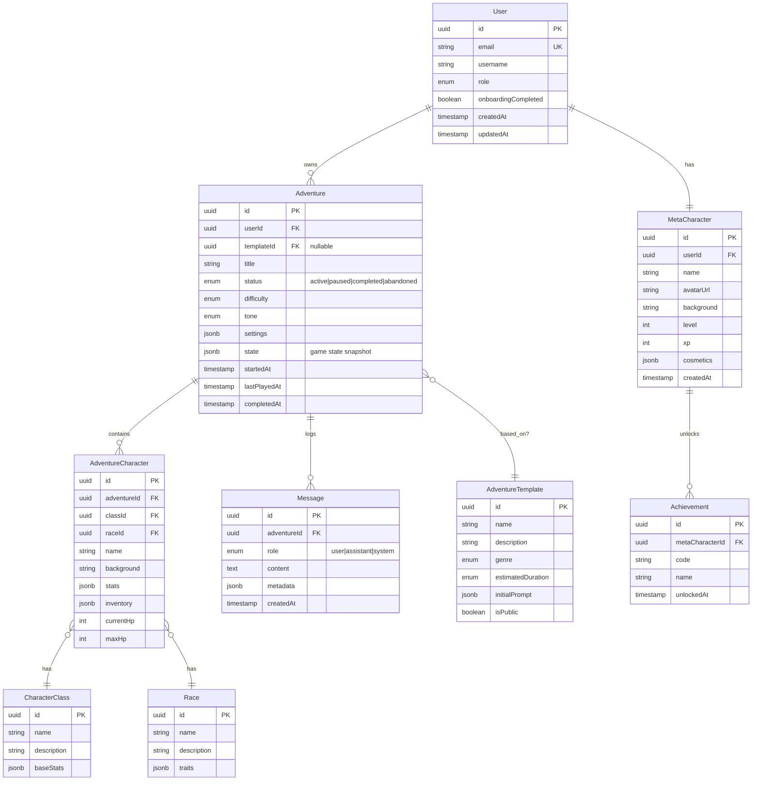

# Modèles de Données

> **Note MVP** : Les modèles ci-dessous représentent la structure initiale. Certains champs (notamment `CharacterStats`, système de règles, races/classes) seront affinés lors de la phase de game design. Le schéma Drizzle permettra des migrations incrémentales.

---

## Vue d'Ensemble (ERD)



---

## Interfaces TypeScript (DTOs - `packages/shared`)

```typescript
// packages/shared/src/types/user.ts
export interface UserDTO {
  id: string;
  email: string;
  username: string;
  role: "user" | "admin";
  onboardingCompleted: boolean;
  createdAt: string;
}

export interface UserCreateInput {
  email: string;
  username: string;
  password: string;
}

export interface UserLoginInput {
  email: string;
  password: string;
}
```

```typescript
// packages/shared/src/types/adventure.ts
export type AdventureStatus = "active" | "paused" | "completed" | "abandoned";
export type Difficulty = "easy" | "normal" | "hard" | "nightmare";
export type Tone = "serious" | "humorous" | "epic" | "dark";

export interface AdventureDTO {
  id: string;
  title: string;
  status: AdventureStatus;
  difficulty: Difficulty;
  tone: Tone;
  startedAt: string;
  lastPlayedAt: string;
  character: AdventureCharacterDTO;
}

export interface AdventureCreateInput {
  templateId?: string;
  title: string;
  difficulty: Difficulty;
  tone: Tone;
  character: AdventureCharacterCreateInput;
}

export interface AdventureCharacterDTO {
  id: string;
  name: string;
  className: string;
  raceName: string;
  stats: CharacterStats;
  currentHp: number;
  maxHp: number;
}

export interface AdventureCharacterCreateInput {
  name: string;
  classId: string;
  raceId: string;
  background: string;
  stats: CharacterStats;
}

export interface CharacterStats {
  strength: number;
  agility: number;
  charisma: number;
  karma: number;
}
```

```typescript
// packages/shared/src/types/game.ts
export type MessageRole = "user" | "assistant" | "system";

export interface GameMessageDTO {
  id: string;
  role: MessageRole;
  content: string;
  createdAt: string;
  choices?: SuggestedAction[];
}

export interface SuggestedAction {
  id: string;
  label: string;
  type: "suggested" | "custom";
}

export interface PlayerActionInput {
  adventureId: string;
  action: string;
  choiceId?: string; // if selecting a suggested action
}

export interface GameStateDTO {
  adventure: AdventureDTO;
  messages: GameMessageDTO[];
  isStreaming: boolean;
}
```

---

## Package Partagé (`packages/shared`)

```
packages/shared/
├── src/
│   ├── schemas/             # Schémas Zod (générés + manuels)
│   │   ├── user.schema.ts
│   │   ├── adventure.schema.ts
│   │   ├── game.schema.ts
│   │   └── index.ts
│   ├── types/               # Types TypeScript
│   │   ├── user.ts
│   │   ├── adventure.ts
│   │   ├── game.ts
│   │   ├── api.ts           # Types réponses API
│   │   └── index.ts
│   ├── constants/
│   │   ├── game.constants.ts
│   │   └── index.ts
│   └── index.ts             # Export principal
├── tsconfig.json
└── package.json
```
